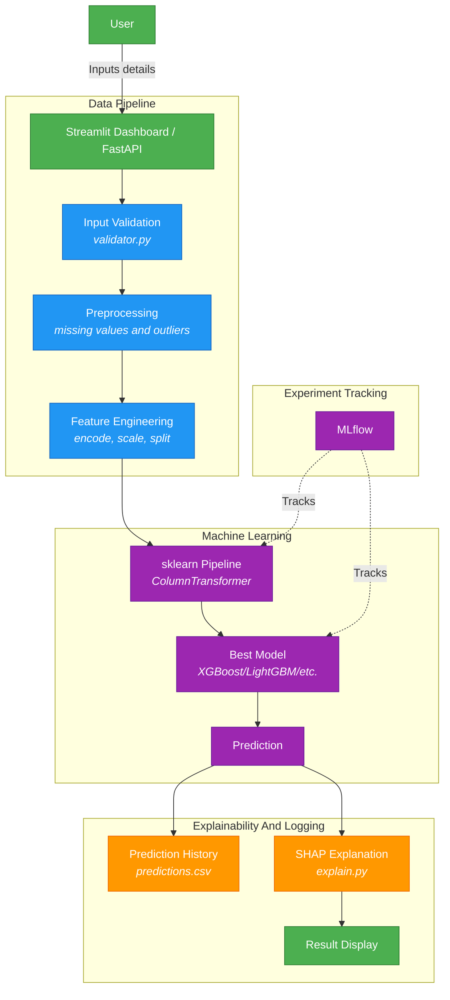

# Chance of Admission Prediction - System Architecture

## Flow Description

1. A user enters an academic and demographic profile through Streamlit or the
   FastAPI REST endpoint.
2. Inputs are validated against rules in `src/validator.py`.
3. A saved scikit-learn pipeline scales numerical features and encodes
   categorical, ordinal, and binary features.
4. The trained regression model predicts admission probability.
5. Optional SHAP values explain the most influential transformed features.
6. Input and prediction metadata are appended to `reports/predictions.csv`.

This architecture is designed for a synthetic-data demonstration project. It is
not a real admissions decision system.
